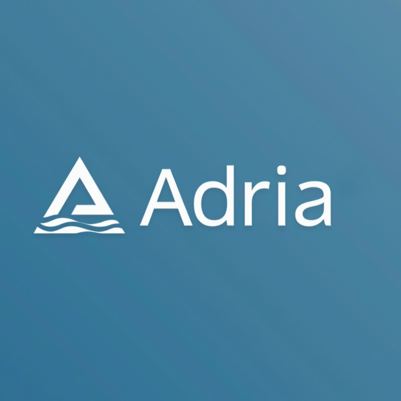

# Adria-DX12

Graphics engine written in C++ using DirectX12. 

## Features
* Render graph
    - Automatic resource barriers
    - Resource reuse using resource pool
    - Automatic resource bind flags and initial state deduction
    - Pass culling
    - Graph visualization
* DDGI
* GPU-Driven Rendering : GPU frustum culling + 2 phase GPU occlusion culling
* Reference path tracer 
* Temporal upscalers : FSR2, FSR3, XeSS, DLSS3
* Ultimate Bindless resource binding
* Variable Rate Shading (FFX)
* Volumetric lighting
    - 2D Raymarching
    - Fog volumes
* Tiled/Clustered deferred rendering 
* Shadows
    - PCF shadows for directional, spot and point lights
    - Cascade shadow maps for directional lights
    - Ray traced shadows (DXR)
* Volumetric clouds
* Hosek-Wilkie sky
* FFT Ocean
* Automatic exposure
* Bloom
* Rain
* Tony McMapface tonemapping
* Depth of field + Bokeh: Custom, FFX
* Ambient occlusion: SSAO, HBAO, CACAO (FFX), RTAO (DXR)
* Reflections: SSR, RTR (DXR)
* Antialiasing: FXAA, TAA
* Contrast Adaptive Sharpening (FFX)
* Film effects: Lens distortion, Chromatic aberration, Vignette, Film grain
* Screen-space god rays
* Lens flare: texture-based and procedural
* Profiler: custom and tracy profiler
* Debug tools
    - Debug renderer
    - Shader hot reloading
    - Render graph dump and visualization
    - Shader debug printf
    - Nsight Aftermath SDK
* D3D12 Enhanced Barriers support

## TODO
* ReSTIR GI

## Screenshots

### DDGI

| Disabled |  Enabled |
|---|---|
|  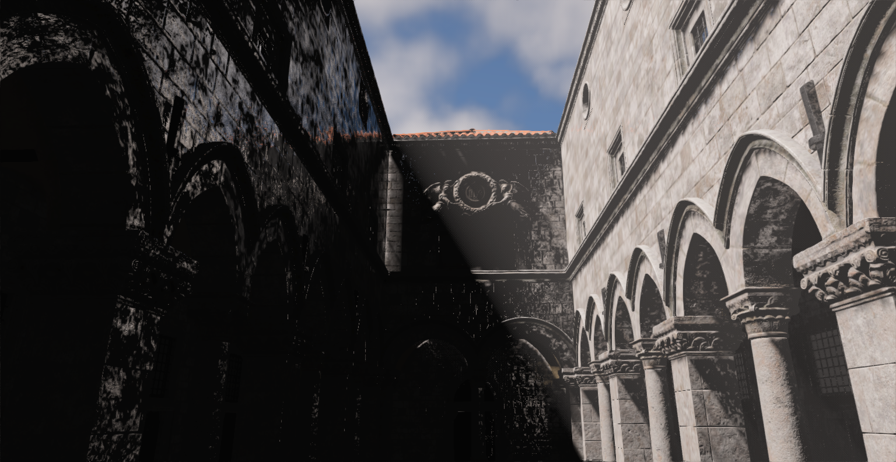 | 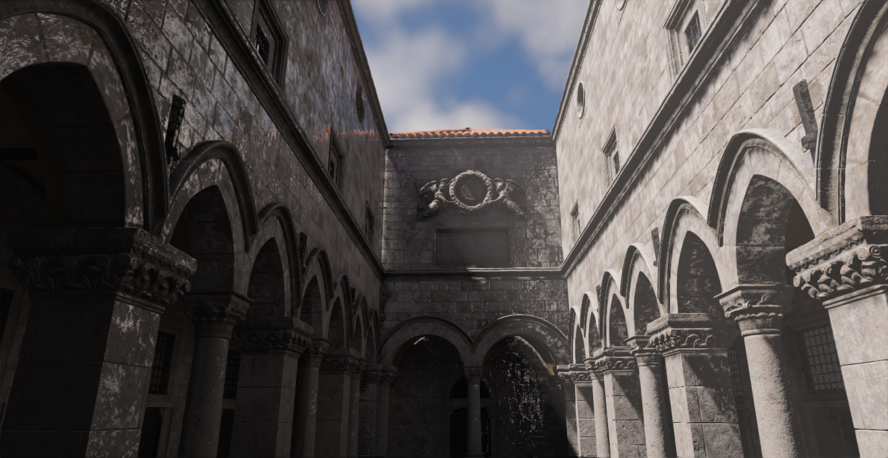 |

| Probe Visualization |
|---|
|  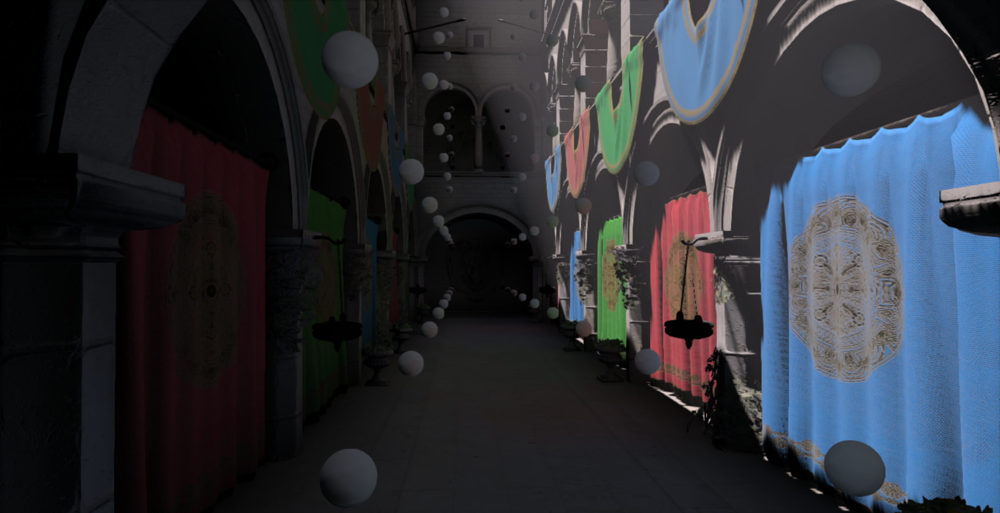 |

### Volumetric Clouds
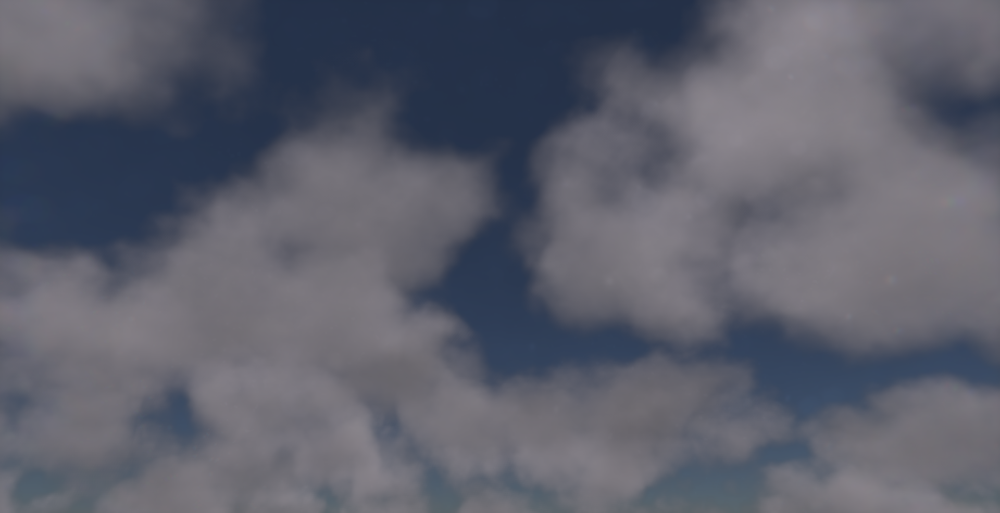 

### San Miguel
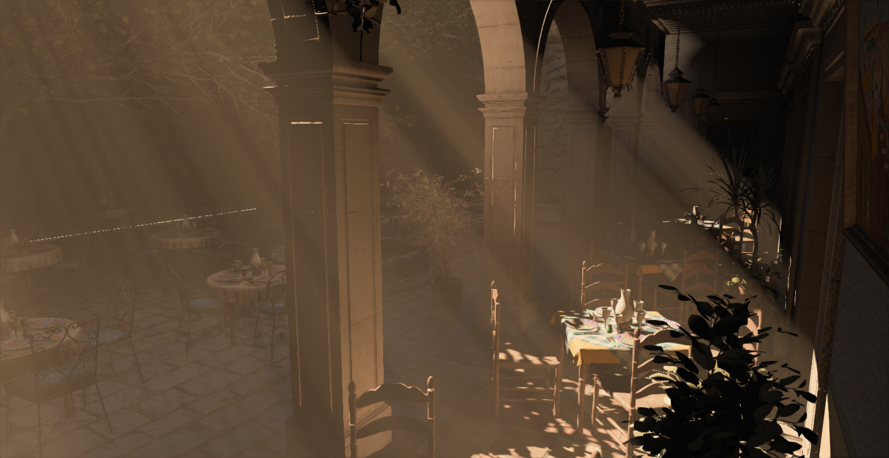 
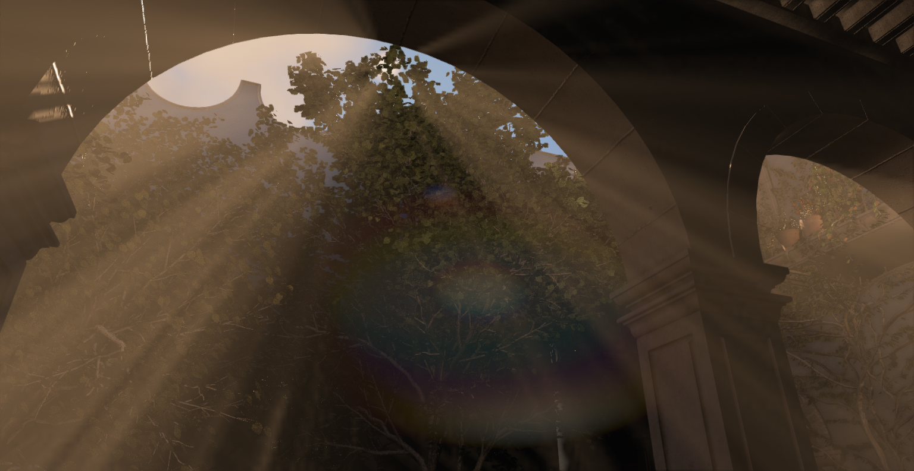 

### Toyshop
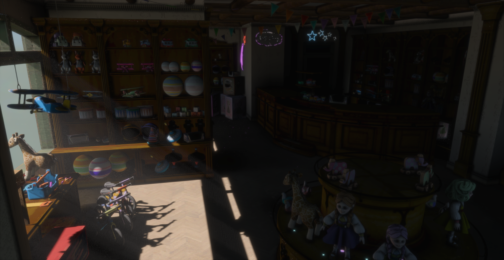 

### Ocean
 

### Path Tracer
 
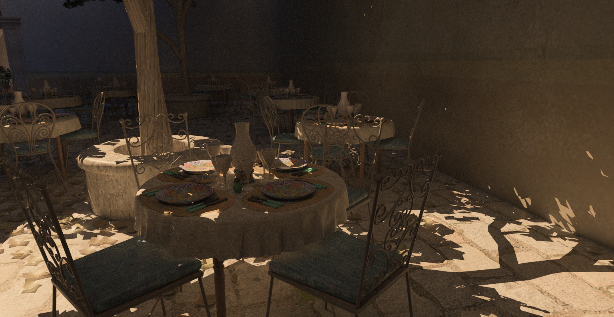 

### Variable Rate Shading
| No VRS | VRS | VRS Overlay |
| ------ | ----------- | ----------- |
| 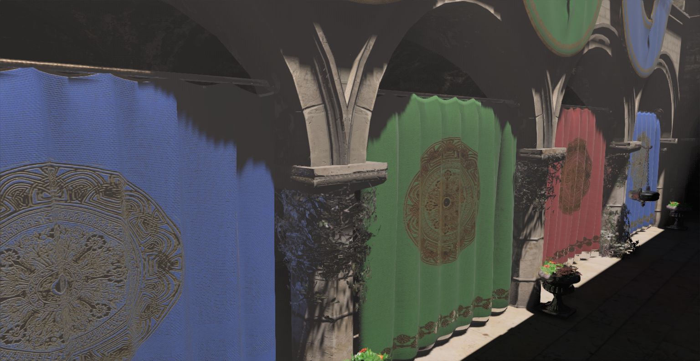 | 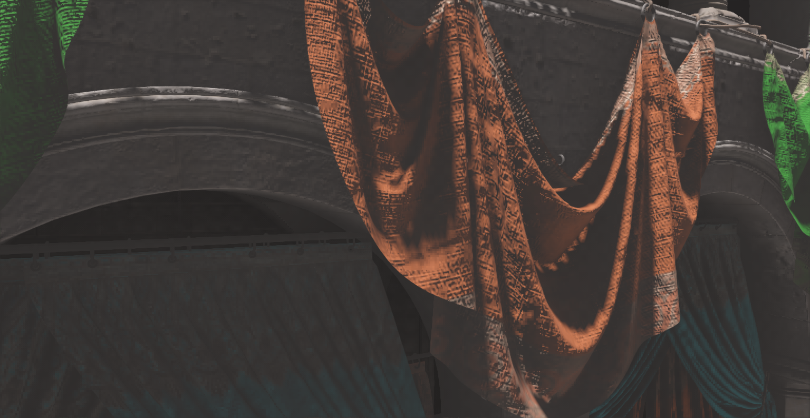 | 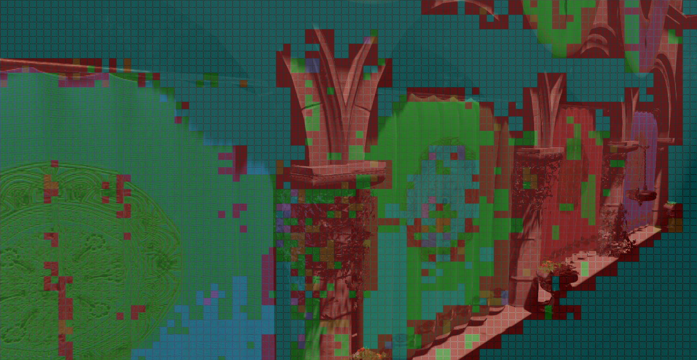 |

### Editor
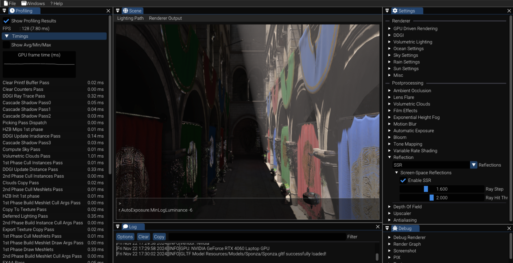 

### Ray Tracing Features

| Cascaded Shadow Maps |  Hard Ray Traced Shadows |
|---|---|
|  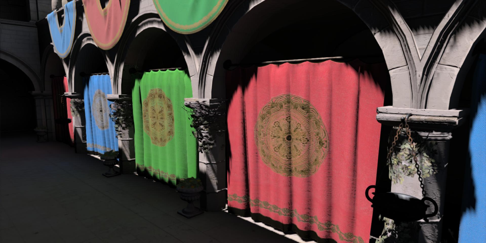 |  |

| Screen Space Reflections |  Ray Traced Reflections |
|---|---|
|  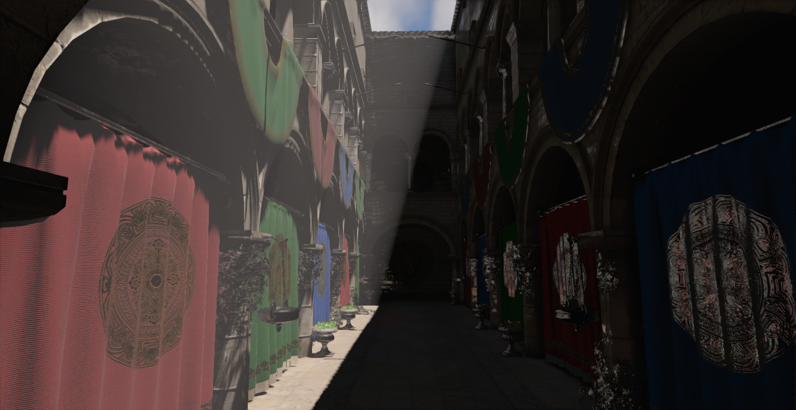 | 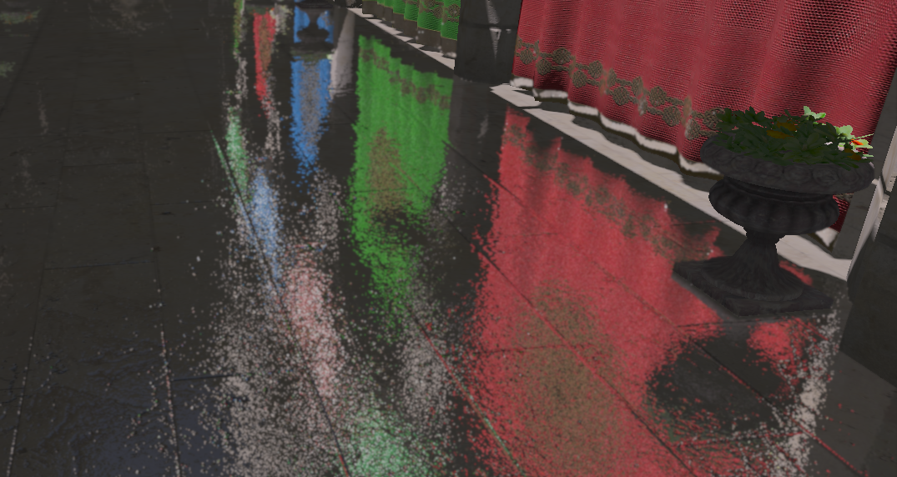 |

| SSAO | RTAO |
|---|---|
|   | 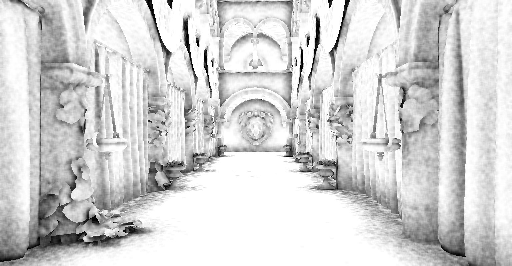 |

### Render Graph Visualization
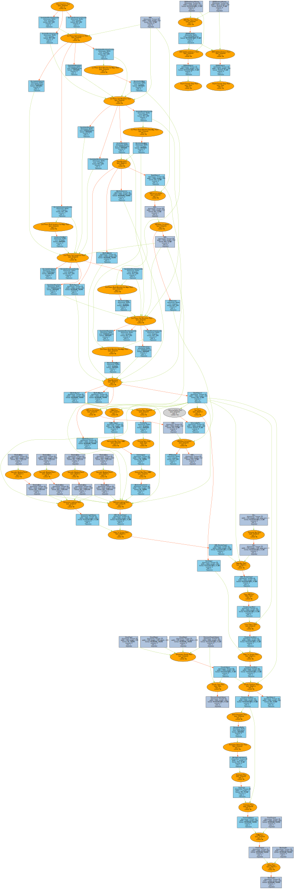 

### Rain
https://github.com/user-attachments/assets/46eda5ad-040d-450b-9a07-a6aef9de3e92

