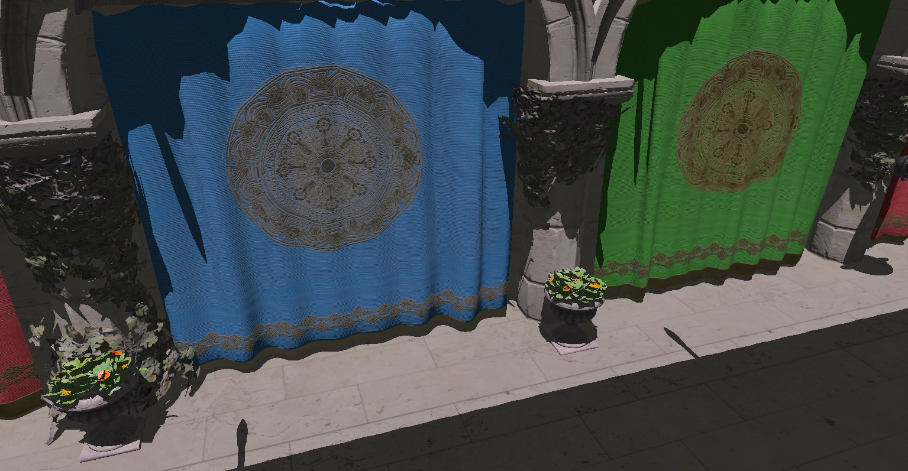

# Adria-DX12

Graphics engine written in C++/DirectX12. For successful build you will need textures that you can find [here](https://github.com/mateeeeeee/Adria-DX11/releases/tag/1.0).
## Features
* Entity-Component System
* Deferred + Forward Rendering 
* Tiled Deferred Rendering 
* Clustered Deferred Rendering
* Physically Based Shading
* Image Based Lighting
* Normal Mapping
* Hard Ray Traced Shadows (DXR)
* Shadows
    - PCF Shadows for Directional, Spot and Point lights
    - Cascade Shadow Maps for Directional Lights
* Volumetric Lighting
    - Directional Lights with Shadow Maps
    - Directional Lights with Cascade Shadow Maps
    - Point and Spot Lights 
* HDR and Tone Mapping
* Bloom
* Depth Of Field
* Bokeh
* Ambient Occlusion: SSAO, HBAO, RTAO (DXR)
* SSR
* SSCS
* Deferred Decals
* FXAA
* TAA
* God Rays
* Lens Flare
* Motion Blur
* Fog
* Volumetric Clouds
* Hosek-Wilkie Sky
* Ocean FFT
    - Adaptive Tesselation
    - Foam
* Particles
* ImGui Editor
* Profiler
* Model Loading with tinygltf
* Camera and Light Frustum Culling
* Multithreaded Command List Building
* DirectX12 Render Passes

## Dependencies
[tinygltf](https://github.com/syoyo/tinygltf)

[ImGui](https://github.com/ocornut/imgui)

[ImGuizmo](https://github.com/CedricGuillemet/ImGuizmo)

[ImGuiFileDialog](https://github.com/aiekick/ImGuiFileDialog)

[stb](https://github.com/nothings/stb)

[DirectXShaderCompiler](https://github.com/microsoft/DirectXShaderCompiler)

[D3D12MemoryAllocator](https://github.com/GPUOpen-LibrariesAndSDKs/D3D12MemoryAllocator)

[FastNoiseLite](https://github.com/Auburn/FastNoiseLite)

[json](https://github.com/nlohmann/json)

## Screenshots

Since this is DirectX 12 port of this [engine](https://github.com/mate286/Adria-DX11), you can see some of the screenshots there. 
All of DXR screenshots will go here:

<table>
  <tr>
    <td>Filtered shadows using 3 cascades</td>
     <td>Hard ray traced shadows</td>
     </tr>
  <tr>
    <td></td>
    <td></td>
  </tr>
 </table>
