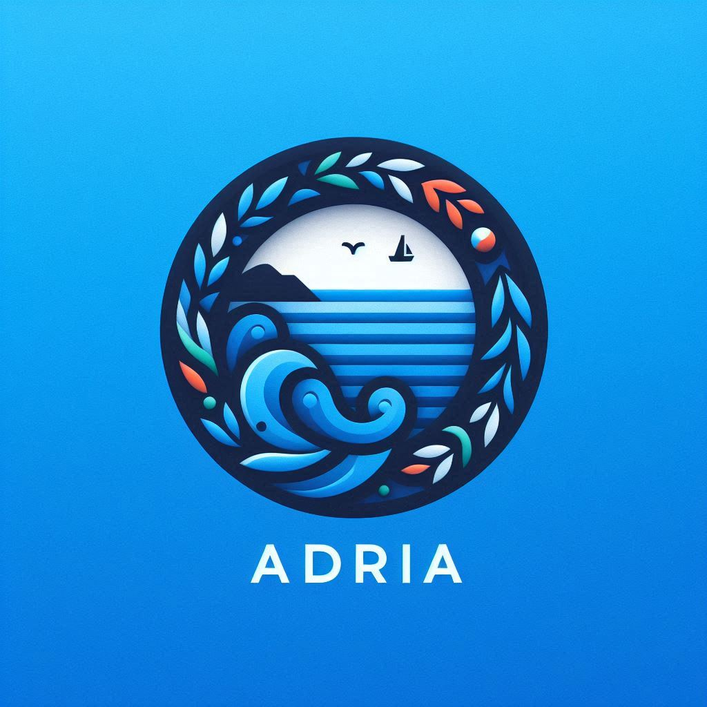

# Adria-DX12

Graphics engine written in C++ using DirectX12. For successful build you will need textures that you can find [here](https://github.com/mateeeeeee/Adria-DX11/releases/tag/1.0).
 
## Features
* Render graph
	- Automatic resource barriers
	- Resource reuse using resource pool
	- Automatic resource bind flags and initial state deduction
	- Pass culling
    - Graph visualization
* DDGI
    - Probe visualization
* GPU-Driven Rendering
    - GPU frustum culling
    - 2 phase GPU occlusion culling
* Reference path tracer 
* Ultimate Bindless 
    - Only one root signature 
* Tiled deferred rendering 
* Clustered deferred rendering
* Ray traced shadows (DXR)
* Shadows
    - PCF shadows for directional, spot and point lights
    - Cascade shadow maps for directional lights
* Volumetric lighting for shadow casting lights
* HDR and tone mapping
* Automatic exposure
* Bloom
* Depth of field + Bokeh
* Ambient occlusion: SSAO, HBAO, RTAO (DXR)
* Reflections: SSR, RTR (DXR)
* Deferred decals
* FXAA
* TAA
* God rays
* Lens flare
* Motion blur
* Fog
* Volumetric clouds
    - Temporal reprojection
* Hosek-Wilkie sky
* Ocean FFT
    - Adaptive tesselation
    - Foam
* Shader hot reload
* Debug Renderer
* ImGui Editor
* Profiler
    - custom and tracy profiler
* Model Loading with tinygltf

## TODO
* FSR2
* ReSTIR GI

## Dependencies
[ImGui](https://github.com/ocornut/imgui)

[DirectXShaderCompiler](https://github.com/microsoft/DirectXShaderCompiler)

[D3D12MemoryAllocator](https://github.com/GPUOpen-LibrariesAndSDKs/D3D12MemoryAllocator)

[nativefiledialog](https://github.com/mlabbe/nativefiledialog)

[tracy](https://github.com/wolfpld/tracy)

[stb](https://github.com/nothings/stb)

[cereal](https://github.com/USCiLab/cereal)

[tinygltf](https://github.com/syoyo/tinygltf)

[json](https://github.com/nlohmann/json)

[ImGuizmo](https://github.com/CedricGuillemet/ImGuizmo)

## Screenshots

### DDGI

| Disabled |  Enabled |
|---|---|
|  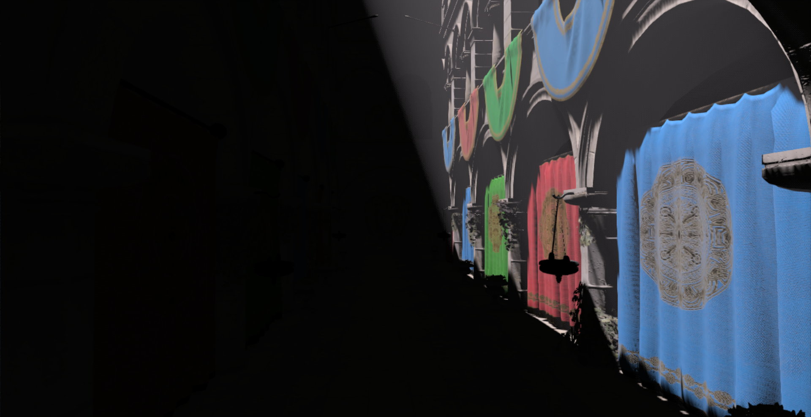 | 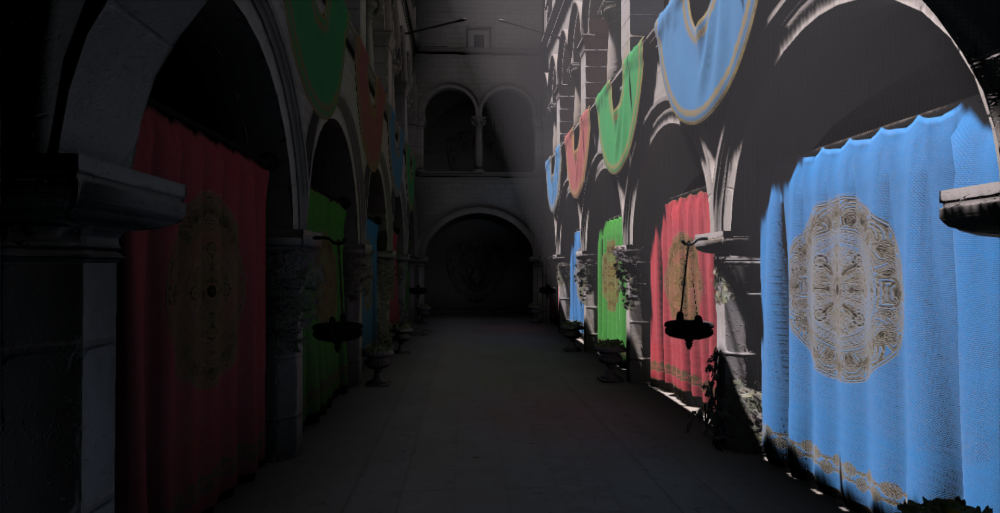 |

| Probe Visualization |
|---|
|   |

### Volumetric Clouds
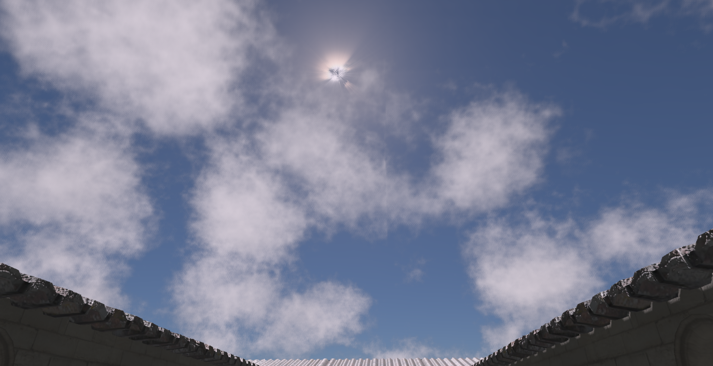 

### San Miguel
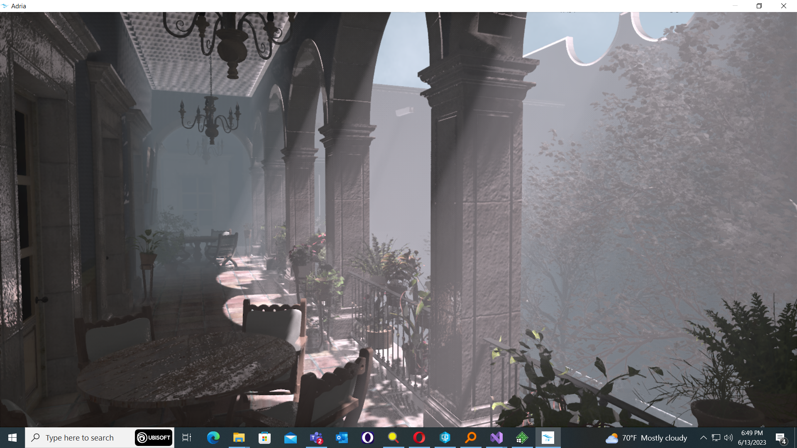 

### Ocean
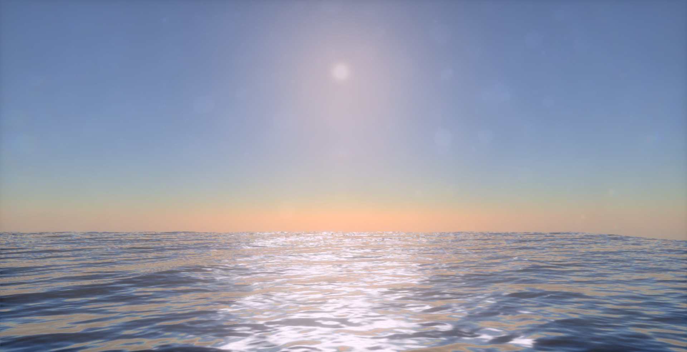 

### Path Tracer
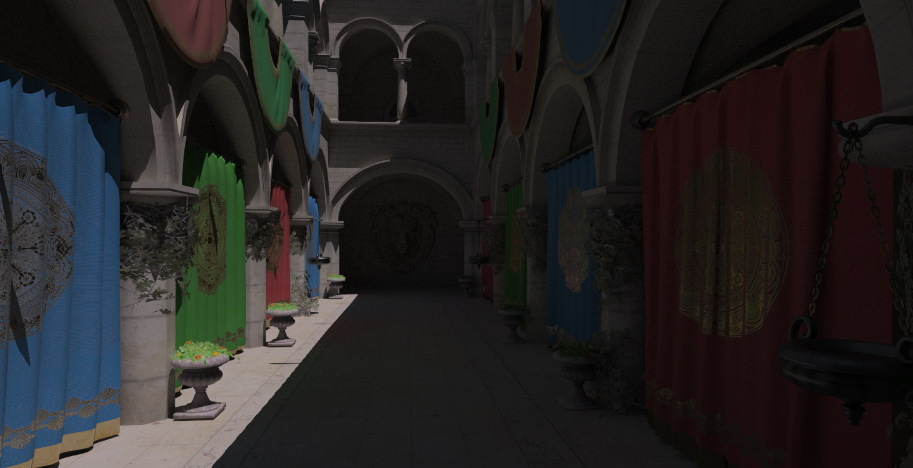 
 

### Ray Tracing features

| Cascaded Shadow Maps |  Hard Ray Traced Shadows |
|---|---|
|  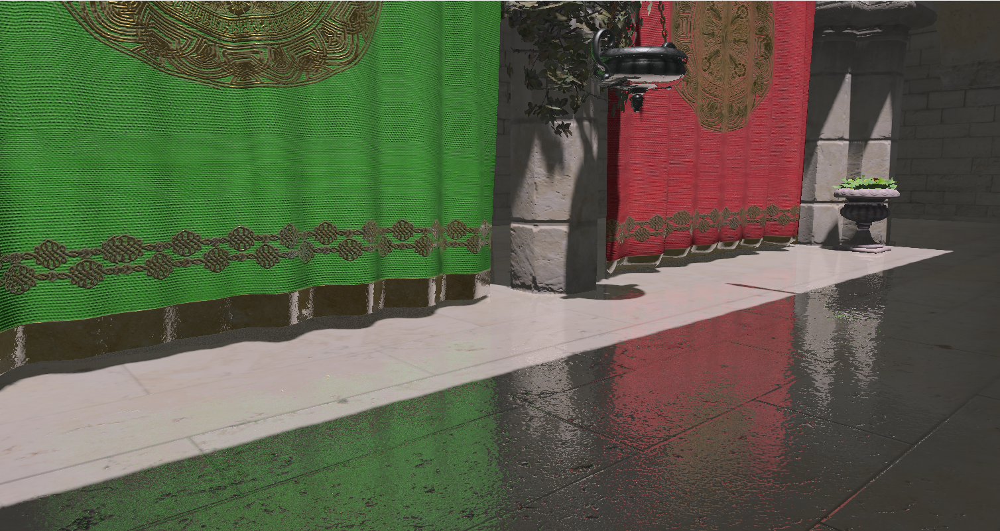 |  |

| Screen Space Reflections |  Ray Traced Reflections |
|---|---|
|  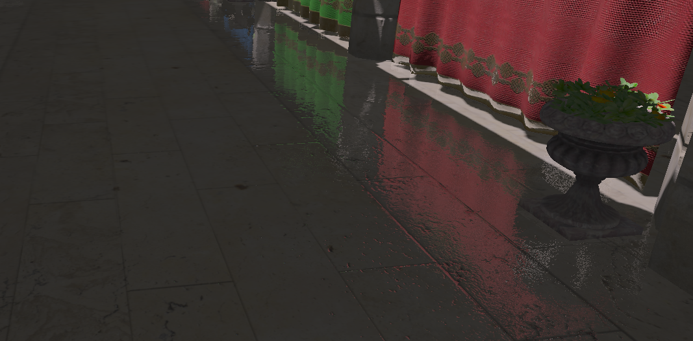 | 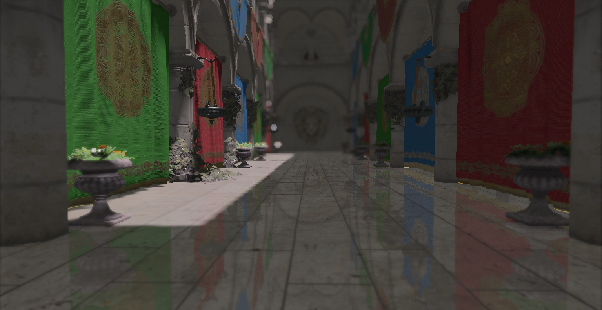 |

| SSAO | RTAO |
|---|---|
|  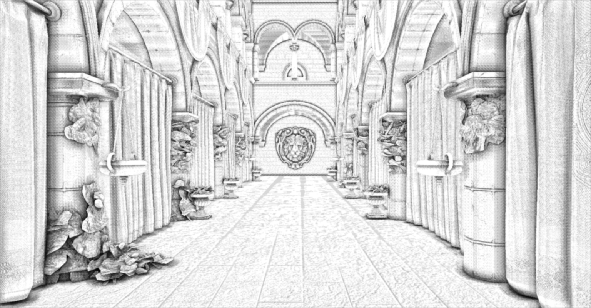 |  |

### Render graph visualization
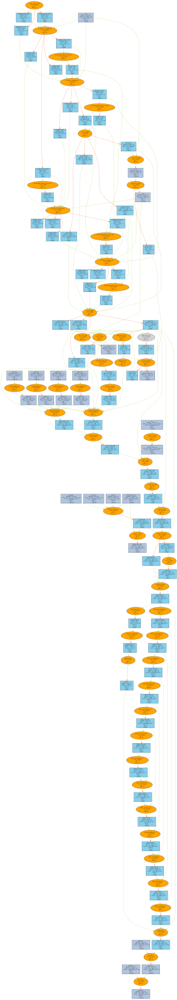 
